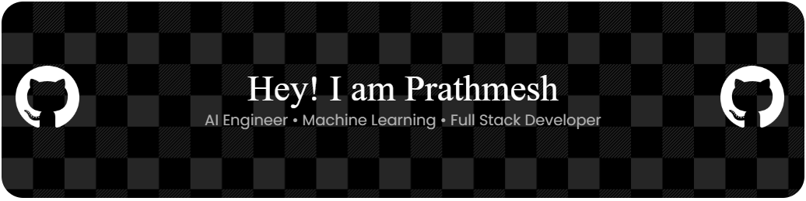

  

# Hi 👋 I'm Prathmesh Harkal

### AI & Machine Learning Engineer

## 🌐 Connect With Me

Building AI-powered applications using Machine Learning, Deep Learning, NLP, and Full Stack Development.

---

## 🚀 About Me

- 🎓 B.Tech CSE (AI & ML)
- 🤖 Machine Learning Enthusiast
- 🧠 Deep Learning & NLP
- 🌐 Full Stack Developer
- 📚 Solving DSA problems daily
- 💡 Always building real-world projects

---
# 💻 Tech Stack

### 🚀 Programming Languages

---

### 🌐 Frontend Development

---

### ⚙️ Backend Development

---

### 🤖 Artificial Intelligence & Machine Learning

---

### 📊 Data Science

---

### 🗄️ Database

---

### 🛠️ Tools & Platforms

---

### ☁️ Currently Learning

## 🧠 Expertise

| Category | Technologies |
|----------|--------------|
| 💻 Languages | Python, Java, C++, JavaScript, TypeScript |
| 🤖 AI & ML | TensorFlow, PyTorch, Scikit-learn, Keras, OpenCV |
| 🧠 NLP | LSTM, Transformers, Sentiment Analysis, Text Classification |
| 🌐 Frontend | React, Next.js, Tailwind CSS |
| ⚙️ Backend | Node.js, Express.js, REST APIs |
| 🗄️ Databases | MySQL, MongoDB |
| ☁️ Tools | Git, GitHub, Docker, VS Code, Postman |
| 📊 Data Science | Pandas, NumPy, Matplotlib, Jupyter |

## 🎯 Areas of Interest

- 🧠 Machine Learning
- 🤖 Deep Learning
- 💬 Natural Language Processing
- 🚀 Generative AI
- 🏗️ Full Stack Development
- 📈 Data Science
- ⚡ Data Structures & Algorithms

  ## 📊 GitHub Stats

## 🐍 Contribution Snake

  

## 🚀 Featured Projects

### 🧠 LearnLens Pro
Student Learning Behaviour Clustering Dashboard

Tech:
Python • Scikit-learn • PCA • JavaScript

---

### ❤️ Lifestyle Disease Prediction

Random Forest

XGBoost

Neural Networks

---

### 😊 Emotion-Aware Sentiment Analysis

LSTM

TensorFlow

NLP

---

### 🌐 Full Stack Portfolio

React

Next.js

Node.js

MongoDB

## 🌱 Currently Learning

- Large Language Models (LLMs)
- Agentic AI
- RAG
- Transformers
- Kubernetes
- System Design

  ## 📈 Contribution Graph

## 👀 Profile Views

## 💭 Developer Quote

---

⭐ If you like my work, consider starring my repositories!

Thanks for visiting my profile! 🚀
